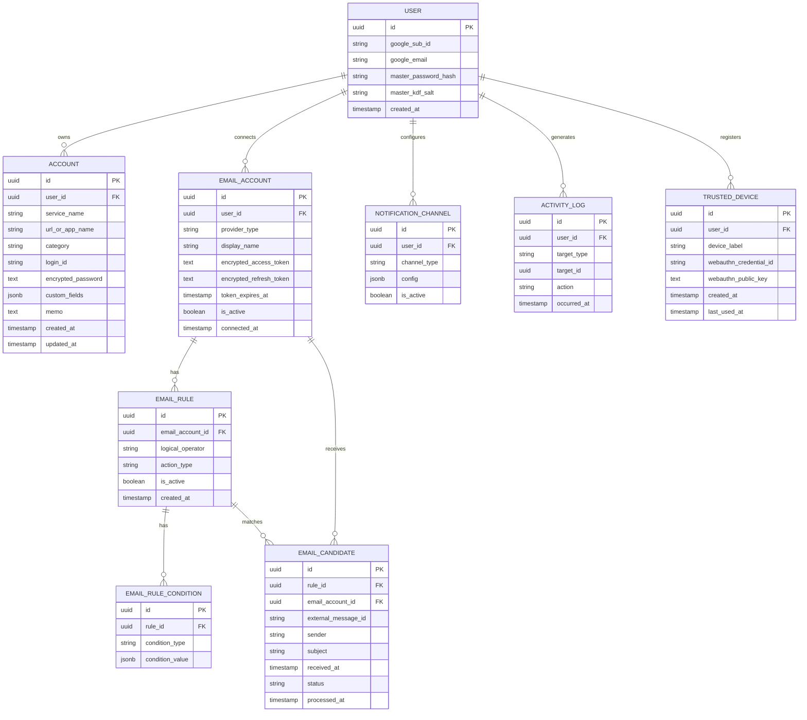

# 통합 계정관리 프로그램 기술설계서

- **작성일**: 2026-09-08
- **작성자**: 명익
- **문서 버전**: v0.5 (2026-09-14 — 마스터 비밀번호 복구 정책, Gmail 토큰 암호화 키 정책 확정. 이 시점 이후 실제 구현 진행상황은 `CLAUDE.md`가 더 최신일 수 있음)
- **기반 문서**: 계정관리 프로그램 기획서 v0.5

이 문서는 기획서에서 정한 기능/화면/보안 요구사항을 실제로 구현 가능한 수준까지 구체화한다. 순서는 (1) 기술 스택 선정 → (2) DB 스키마/ERD → (3) API 명세 → (4) 화면 구조/폴더 구조로 진행한다.

---

## 1. 기술 스택 선정

1인 개발, 웹앱 우선, 확장 가능한 구조(기획서 9장), 보안이 중요한 프로젝트라는 조건을 기준으로 아래 스택을 추천한다. 전체적으로 "혼자 유지보수 가능하면서도 타입 안정성이 높은" 조합을 우선했다.

| 영역 | 선택 | 이유 |
|---|---|---|
| 프론트엔드 | **Next.js (React + TypeScript, App Router)** | 파일 기반 라우팅으로 화면(5장) 구성이 직관적이고, 배포(Vercel 등)가 간편하다. TypeScript로 API 응답 타입을 프론트/백엔드가 공유하기 쉽다. |
| 스타일링 | **Tailwind CSS** (v0.4에는 미정이었던 항목, 구현 중 결정) | 1인 개발에서 별도 디자인 시스템 없이 빠르게 화면을 채울 수 있다. 컴포넌트 라이브러리(shadcn/ui 등)는 실제 화면을 채울 때 필요하면 그때 추가. |
| 백엔드 | **NestJS (Node.js + TypeScript)** | 모듈(Module)·프로바이더(Provider) 단위 구조가 기획서 9.1의 "메일 Provider 플러그인 구조"와 정확히 맞아떨어진다. 이메일 서비스가 하나 늘어날 때 NestJS 모듈 하나만 추가하면 되는 구조를 그대로 지원한다. |
| 데이터베이스 | **PostgreSQL** | 관계형 데이터(계정-비밀번호-규칙 간 관계)에 적합하고, `JSONB` 타입으로 규칙 조건이나 커스텀 필드처럼 가변적인 데이터도 스키마 변경 없이 저장할 수 있다. |
| ORM | **Prisma** (7.x) | 스키마 파일 하나로 타입과 마이그레이션을 함께 관리해 1인 개발에서 유지보수 부담이 적다. Prisma 7부터 `datasource url`을 schema.prisma가 아니라 루트 `prisma.config.ts`(CLI용)와 `PrismaClient` 생성자에 넘기는 `@prisma/adapter-pg`(런타임용)로 분리해서 관리한다 — `apps/api/src/common/prisma/prisma.service.ts` 참고. |
| 앱 로그인(신원 확인) | **Google OAuth 2.0 (Sign in with Google)** | 자체 회원가입·비밀번호 저장·비밀번호 재설정 기능을 직접 구현하지 않아도 되어 1인 개발 부담이 줄어든다. Gmail 연동에 쓰는 OAuth와 별개 스코프로 취급한다. Google Cloud Console에는 **OAuth 클라이언트를 1개만** 등록해 공용으로 쓴다 — `/auth/google/*`(앱 로그인)는 `openid`/`email`/`profile` 최소 스코프만, `/email-accounts/oauth/*`(Gmail 연동)는 Gmail 스코프만 각 요청 시점에 나눠서 요청한다(incremental authorization). 1인 개인용 앱이라 클라이언트를 분리해서 얻는 이득보다 `.env` 관리 부담이 더 크다고 판단. |
| 마스터 비밀번호(데이터 열람 자격) | **Argon2id (키 유도) + AES-256-GCM (데이터 암호화)** | Argon2id는 현재 권장되는 비밀번호 기반 키 유도 함수(brute-force에 강함), AES-256-GCM은 무결성 검증까지 포함하는 대칭키 암호화 방식이다. 앱 로그인(Google)과 완전히 독립적으로 유지한다. |
| 기기별 생체인증 | **WebAuthn (Platform Authenticator)** | 지문/Face ID/터치ID/윈도우 헬로를 지원하는 기기에서, 최초 마스터 비밀번호 잠금해제 이후 그 기기에 한해 타이핑 없이 빠르게 잠금 해제할 수 있게 한다. 감싸진 암호화 키는 서버가 아닌 해당 기기에만 보관한다. |
| 세션 관리 | **httpOnly 쿠키 기반 서버 세션** (JWT 대신, `express-session` + `connect-pg-simple`) | 토큰을 프론트엔드 JS가 직접 다루지 않게 해 XSS로 인한 탈취 위험을 낮춘다. 세션 저장소는 초기엔 DB(Postgres) 테이블로 충분하고, 트래픽이 늘면 Redis로 교체 가능. **단, 마스터 비밀번호에서 유도한 AES 키는 세션 데이터(=DB)에 절대 넣지 않는다** — 별도 서버 메모리 저장소(`UnlockKeyStoreService`, 세션ID로 조회)에만 두어, DB가 통째로 유출돼도 이미 로그인된 세션의 평문 접근 키까지 같이 새어나가지 않게 한다. 대가로 서버 프로세스가 재시작되면 모든 세션이 다시 "잠금" 상태가 된다(의도된 동작). |
| Gmail 연동 | **googleapis (공식 Node.js 클라이언트) + OAuth 2.0** | Google이 공식 지원하는 라이브러리로 Gmail API(메일 조회/라벨/삭제) 호출과 OAuth 토큰 갱신을 안정적으로 처리한다. |
| 주기적 스캔(스케줄링) | **@nestjs/schedule (node-cron 기반)** | 별도 큐 서버(Redis 등) 없이 NestJS 안에서 바로 크론 작업을 등록할 수 있어 1인 프로젝트 초기 단계에 적합하다. 후속 확장(대량 계정 처리) 시 BullMQ 같은 큐로 교체 가능하도록 스캔 로직을 서비스 계층으로 분리해둔다. |
| 배포 | 프론트: **Vercel**, 백엔드: **Fly.io / Railway 등 컨테이너 호스팅**, DB: **Supabase Postgres 또는 동일 호스팅사의 managed Postgres** | 1인 운영 부담을 최소화하는 관리형 서비스 조합. |

> 특정 서비스명(Vercel, Fly.io 등)은 예시이며, 실제 배포 단계에서 비용/운영 편의성을 비교해 확정한다.

---

## 2. DB 스키마 / ERD

기획서 6장의 데이터 모델을 실제 테이블로 구체화한다. 1인 사용이지만 `User` 테이블은 그대로 두어, 이후 인증 방식이 늘어나거나 계정을 이전할 때 흔들리지 않게 한다.

### 2.1 ERD 개요 (Mermaid)



### 2.2 테이블별 설명 및 확장 포인트

- **User**: `google_sub_id`/`google_email`은 Google 로그인(앱 로그인, 신원 확인) 결과를 저장한다 — 자체 비밀번호는 저장하지 않는다. `master_password_hash`, `master_kdf_salt`는 이와 완전히 별개로, 마스터 비밀번호 검증 및 데이터 암호화 키 유도에만 사용한다(7장 참고). 비밀번호 원문이나 유도된 암호화 키 자체는 저장하지 않는다.
- **TrustedDevice**: 생체인증(지문/Face ID 등)으로 빠른 잠금해제를 등록한 기기 목록. `webauthn_public_key`는 그 기기가 맞는지 서버가 검증하는 용도일 뿐이고, **실제 암호화 키(감싸진 형태)는 서버 DB가 아니라 해당 기기 로컬에만 저장한다** — 서버가 이 키까지 갖고 있으면 서버 유출 시 생체인증 없이도 키를 꺼낼 수 있게 되어 생체인증을 둔 의미가 없어지기 때문이다.
- **Account**: `custom_fields`를 `jsonb`로 두어 사이트별로 다른 부가 정보(보안질문, 유효기간 등)를 스키마 변경 없이 추가할 수 있다(기획서 9.6). `(user_id, url_or_app_name, login_id)` 조합에 유니크 제약을 걸어 완전히 같은 사이트+아이디 중복 등록을 막는다. 부계정은 `login_id`가 다르므로 제약에 걸리지 않는다.
- **EmailAccount**: `provider_type`이 지금은 `"gmail"` 값 하나뿐이지만, 다른 메일 서비스를 붙일 때 이 컬럼에 새 값을 추가하고 해당 Provider 모듈만 구현하면 된다(9.1). `encrypted_access_token`(수명 짧음, 자주 갱신)과 `encrypted_refresh_token`(수명 김, 거의 갱신 안 함)을 각각 별도 컬럼으로 암호화해서 저장해, access token 갱신 시 refresh token 쪽은 복호화/재암호화를 건드리지 않는다. `token_expires_at`으로 access token 만료 시점을 추적한다. **이 두 필드는 마스터 비밀번호 유도 키가 아니라 서버가 별도로 관리하는 키로 암호화한다(7.2 참고)** — 백그라운드 자동 스캔(기획서 3.4.2)이 앱 잠금 상태와 무관하게 동작해야 하기 때문이다. Account의 `encrypted_password`와는 다른 키 체계를 쓴다는 점에 주의.
- **EmailRule / EmailRuleCondition**: 규칙(EmailRule)과 조건(EmailRuleCondition)을 분리해서, 규칙 하나에 조건을 1~5개까지 자유롭게 연결할 수 있게 했다. `EmailRule.logical_operator`(`AND`/`OR`)가 연결된 조건들을 어떻게 판정할지 정하고(조건이 1개면 무의미하므로 무시), `EmailRuleCondition.condition_type`(`sender`/`subject_keyword`/`body_keyword`/`has_emoji`/`has_attachment`)과 `condition_value`(jsonb, 타입별로 형태가 다름 — 예: sender는 `{"domain": "coupang.com"}`, subject_keyword는 `{"contains": "결제"}`)가 실제 조건 내용을 담는다. 새 조건 종류가 필요해지면 `condition_type`에 값만 추가하면 된다(9.2). `EmailRule.action_type`은 `delete_candidate` / `spam_candidate` / `important` 세 값으로 시작한다.
- **EmailCandidate**: 실제 Gmail 메시지 ID(`external_message_id`)를 저장해 승인 시 어떤 메일을 처리할지 추적한다. `status`는 `pending` → `approved` / `excluded` → `processed`로 전이한다. `email_account_id`를 `rule_id`와 별개로 직접 저장해두어(비정규화), 계정별 조회/집계 시 `EmailRule`을 거치지 않아도 되고, 규칙이 나중에 삭제·변경돼도 "그때 어느 계정 메일을 처리했는지" 기록이 그대로 남는다.
- **NotificationChannel**: `channel_type`이 지금은 `in_app`뿐이지만 이후 `push`, `email`, `slack` 등을 추가할 수 있다(9.3). 지금 단계에서는 `EmailCandidate`와 직접 연결하지 않고 "어떤 알림 방법이 켜져 있는지"를 나타내는 설정 목록으로만 둔다 — "중요" 메일 알림은 `EmailCandidate`를 `action_type = important` 조건으로 계정별 개수 집계해서 대시보드에 요약으로 보여주는 방식으로 시작한다. 채널별 발송 이력을 추적할 필요가 생기면 그때 별도 로그 테이블을 추가한다.
- **ActivityLog**: `target_type` + `target_id` 조합으로 어떤 엔티티든 범용적으로 로그를 남길 수 있게 한다.

---

## 3. API 명세 (REST, 초안)

베이스 경로는 `/api/v1`으로 가정한다. 인증이 필요한 요청은 세션 쿠키를 기준으로 하며, 마스터 비밀번호로 잠금 해제되지 않은 세션은 계정/비밀번호 관련 API에서 401을 반환한다.

프론트(`apps/web`, 기본 포트 3000)와 백엔드(`apps/api`, 기본 포트 3001)가 다른 포트라 브라우저
기준으로는 크로스 오리진이다 — httpOnly 세션 쿠키가 실리려면 백엔드가 `Access-Control-Allow-Credentials: true`로
CORS를 열어야 하고(`main.ts`의 `FRONTEND_ORIGIN` env 참고), 프론트의 모든 fetch 호출도
`credentials: "include"`를 명시해야 한다(`apps/web/src/lib/api.ts`의 `apiFetch`).

### 3.1 인증 / 잠금

| Method | Endpoint | 설명 |
|---|---|---|
| GET | `/auth/google/start` | Google OAuth 로그인 시작 URL 반환 (앱 로그인용) |
| GET | `/auth/google/callback` | Google OAuth 콜백 처리. 이미 있는 사용자면 User 조회 후 세션 생성, 처음 로그인하는 사용자면 (아직 마스터 비밀번호가 없어 User row를 만들 수 없으므로) Google 프로필만 세션에 임시 보관하고 `needs_master_password_setup` 상태를 반환한다 |
| POST | `/auth/master-password/setup` | **(구현 중 추가, v0.4에는 없던 엔드포인트)** 최초 Google 로그인 직후 마스터 비밀번호를 처음 설정 — 이 시점에 비로소 User row(해시+salt 포함)를 생성하고 세션을 로그인+잠금해제 상태로 만든다. `google/callback`이 `needs_master_password_setup`을 반환했을 때만 호출 가능 |
| POST | `/auth/unlock` | 마스터 비밀번호 검증 → 세션에 "잠금 해제" 상태 표시 |
| POST | `/auth/lock` | 세션의 잠금 해제 상태 해제 (수동 잠금) |
| POST | `/auth/logout` | 세션 종료 |
| GET | `/auth/me` | 현재 세션의 로그인/잠금해제 상태 조회 |
| GET | `/auth/webauthn/devices` | 등록된 신뢰 기기 목록 조회 (`/settings` 화면용) |
| POST | `/auth/webauthn/register-options` | 이 기기를 생체인증 기기로 등록하기 위한 WebAuthn 옵션 발급 (마스터 비밀번호로 잠금 해제된 상태에서만 호출 가능) |
| POST | `/auth/webauthn/register` | 생체인증 등록 완료 → TrustedDevice 저장 |
| POST | `/auth/webauthn/authenticate-options` | 등록된 기기의 생체인증 잠금해제용 옵션 발급 |
| POST | `/auth/webauthn/authenticate` | 생체인증 검증 → 세션에 "잠금 해제" 상태 표시 (마스터 비밀번호 입력 대체) |
| DELETE | `/auth/webauthn/:deviceId` | 특정 기기의 생체인증 등록 해제 |

**WebAuthn 구현 메모 (2026-09-14, `@simplewebauthn/server`)**:
- `authenticatorSelection: { authenticatorAttachment: 'platform', residentKey: 'required', userVerification: 'required' }`로
  등록해 디스커버러블(resident) credential만 만든다 — `authenticate-options`가 이메일/아이디
  입력 없이 옵션을 내줄 수 있는 이유(1인 사용 전제라 "어떤 사용자인지" 먼저 물을 필요가 없음).
- `POST /auth/webauthn/authenticate`의 요청 바디는 `{ response, password }`다. **생체인증은
  마스터 비밀번호를 대체하지 않고 "타이핑"만 대체한다**(기획서 7장 원칙) — 서버는 여전히
  `password`를 Argon2id로 검증하고 키를 유도한다. 이 `password`는 신뢰된 기기가 로컬에
  감싸 저장해둔 값을 생체인증 통과 직후 스스로 복호화해 보내주는 것을 전제로 하며, 그
  client-side 감싸기/복호화 로직(예: WebAuthn PRF 확장 등)은 `apps/web`이 생기면 구현한다 —
  지금은 백엔드 절반(옵션 발급/검증/TrustedDevice 저장)만 구현돼 있다.
- `TrustedDevice.counter`(ERD 2.1) — WebAuthn signature counter. 인증마다 갱신하고, 재생공격
  방지에 쓰인다. v0.4 ERD에는 없던 컬럼이라 이번에 추가했다.

### 3.2 계정 관리 (Account)

| Method | Endpoint | 설명 |
|---|---|---|
| GET | `/accounts?category=&q=` | 계정 목록 조회 (카테고리 필터, 검색) |
| POST | `/accounts` | 계정 신규 등록 (동일 `url_or_app_name`+`login_id` 조합이 이미 있으면 409 응답) |
| GET | `/accounts/:id` | 계정 상세 조회 (잠금 해제 상태에서만 비밀번호 복호화 반환) |
| PUT | `/accounts/:id` | 계정 정보 수정 |
| DELETE | `/accounts/:id` | 계정 삭제 |
| POST | `/accounts/generate-password` | 비밀번호 생성기 (옵션: 길이, 문자 조합) |

### 3.3 메일 계정 연결 (EmailAccount)

| Method | Endpoint | 설명 |
|---|---|---|
| GET | `/email-accounts` | 연결된 메일 계정 목록 |
| GET | `/email-accounts/oauth/start?provider=gmail` | Gmail OAuth 인증 시작 URL 반환 |
| GET | `/email-accounts/oauth/callback` | OAuth 콜백 처리, 토큰 저장 |
| DELETE | `/email-accounts/:id` | 메일 계정 연결 해제 |

### 3.4 메일 규칙 (EmailRule)

| Method | Endpoint | 설명 |
|---|---|---|
| GET | `/email-rules?emailAccountId=` | 규칙 목록 조회 (연결된 조건들 포함) |
| POST | `/email-rules` | 규칙 등록 — body에 `conditions`(1~5개 배열), `logicalOperator`(조건 2개 이상일 때 필수), `actionType` 포함 |
| GET | `/email-rules/:id` | 규칙 상세 조회 (조건 목록 포함) |
| PUT | `/email-rules/:id` | 규칙 수정 (조건 배열 통째로 교체) |
| DELETE | `/email-rules/:id` | 규칙 삭제 (연결된 조건도 함께 삭제) |

### 3.5 메일 후보 / 승인 플로우 (EmailCandidate)

| Method | Endpoint | 설명 |
|---|---|---|
| GET | `/email-candidates?status=pending` | 대기 중인 후보 메일 목록 (오늘의 검토함) |
| POST | `/email-candidates/:id/approve` | 개별 승인 → 실제 Gmail 삭제/스팸 처리 실행 |
| POST | `/email-candidates/:id/exclude` | 개별 제외 (처리하지 않음) |
| POST | `/email-candidates/approve-all` | 전체 승인 (필터 조건 지정 가능) |
| POST | `/scan/trigger` | 수동으로 메일 스캔 즉시 실행 (자동 크론과 별개) |

### 3.6 알림 (NotificationChannel / Important Mail)

| Method | Endpoint | 설명 |
|---|---|---|
| GET | `/notifications/summary` | 마지막 확인 이후 쌓인 중요 메일을 `EmailAccount`별로 묶은 개수 요약 (대시보드용) |
| GET | `/notifications?type=important` | 중요 메일 알림함 목록 (상세) |
| GET | `/notification-channels` | 알림 채널 설정 목록 |
| PUT | `/notification-channels/:id` | 알림 채널 설정 변경 |

### 3.7 설정 / 로그

| Method | Endpoint | 설명 |
|---|---|---|
| PUT | `/settings/master-password` | 마스터 비밀번호 변경 |
| PUT | `/settings/auto-lock` | 자동 잠금 시간 설정 |
| GET | `/activity-logs` | 활동 로그 조회 |

---

## 4. 화면 구조 / 라우팅

기획서 5장의 화면을 Next.js 라우트로 매핑한다.

| 화면 | 라우트 | 비고 |
|---|---|---|
| 로그인 / 마스터 비밀번호 입력 | `/login` | 로그인 후 마스터 비밀번호 미해제 시 자동 이동 |
| 대시보드 | `/` (또는 `/dashboard`) | 요약 카드형 UI |
| 계정 목록 | `/accounts` | 카테고리 필터, 검색 |
| 계정 상세/등록·수정 | `/accounts/[id]`, `/accounts/new` | |
| 메일 관리 - 규칙 설정 | `/mail/rules` | Gmail 계정 연결 관리 포함 |
| 메일 관리 - 오늘의 검토함 | `/mail/review` | 승인 플로우 핵심 화면 |
| 중요 메일 알림함 | `/mail/important` | |
| 설정 | `/settings` | 마스터 비밀번호, 자동 잠금, 백업/복구 |

## 5. 프로젝트 폴더 구조 (제안)

1인 개발이므로 하나의 저장소(모노레포)에 프론트/백엔드를 함께 두되 명확히 분리한다.

```
account-manager/
├── apps/
│   ├── web/              # Next.js 프론트엔드
│   └── api/               # NestJS 백엔드
│       └── src/
│           ├── auth/
│           ├── accounts/
│           ├── mail/
│           │   ├── providers/      # gmail.provider.ts 등 (9.1 Provider 구조)
│           │   ├── rules/
│           │   └── candidates/
│           ├── notifications/
│           │   └── channels/       # in-app, (추후) push, email 등
│           └── common/
│               ├── crypto/         # AES-256-GCM, Argon2id 유틸
│               └── logging/
├── packages/
│   └── shared-types/       # 프론트/백엔드 공용 TypeScript 타입
└── prisma/
    └── schema.prisma       # 2장 ERD 반영
```

`mail/providers/` 아래에 Provider별 폴더를 두는 구조가 기획서 9.1에서 말한 "새 메일 서비스는 모듈만 추가"를 코드 레벨에서 그대로 구현하는 지점이다.

## 6. 다음 단계

- [x] Prisma 스키마 파일로 2장 ERD 실제 작성 (`npx prisma generate` 확인 완료). Postgres도
      준비 완료 (2026-09-14, 루트 `docker-compose.yml`) — `prisma migrate dev`로 마이그레이션
      적용, 테이블 10개 생성 확인. 인증/세션/계정 CRUD 전 구간을 실제 DB로 E2E 검증함
      (Google OAuth 콜백만 아직 실제 Console 등록 전이라 로그인 완료 상태를 세션에 직접
      주입하는 방식으로 그 이후 구간을 검증 — `CLAUDE.md` 참고).
- [x] NestJS 프로젝트 스캐폴딩 (`auth`, `accounts`, `mail` 모듈 우선) — 라우트/서비스 뼈대까지, 실제 로직은 대부분 TODO
- [x] Google Cloud Console에서 OAuth 클라이언트 등록 방식 결정 — 클라이언트 1개 공용, 스코프는 요청 시점에 분리(incremental authorization). 실제 콘솔 등록은 사용자가 직접 진행
- [x] 생체인증(WebAuthn) 등록/인증 플로우 완료 (2026-09-14). 기기 로컬 키 저장 방식은
      초안(non-extractable CryptoKey)보다 한 단계 더 나은 방식으로 확정: **WebAuthn PRF
      확장**으로 매번 다시 유도되는 대칭키로 마스터 비밀번호를 감싸서 IndexedDB에 저장한다
      (raw 키 자체는 아예 저장하지 않음 — 생체인증 성공 없이는 그 키 자체가 존재하지 않는
      순간 유도값이라 IndexedDB만 털려도 아무것도 복호화할 수 없음). `apps/web/src/lib/
      webauthn*.ts` + `CLAUDE.md` 참고. PRF 미지원 브라우저/기기는 등록은 되지만 자동
      비밀번호 입력 없이 계속 타이핑 필요(degraded mode).
- [x] 마스터 비밀번호 → 암호화 키 유도 로직 프로토타입 (Argon2id + AES-256-GCM) — `apps/api/src/common/crypto/` (`kdf.util.ts`, `aes.util.ts`, `CryptoService`).
- [x] 마스터 비밀번호 복구 수단 정책 결정 (2026-09-14, 7.1 참고: 옵션 B+C 채택 — 복구 없음 정책 + WebAuthn 완충) — 단, 최초 설정 화면의 경고/체크박스 UI는 아직 미구현.
- [x] Gmail 토큰 암호화 키 정책 결정 (2026-09-14, 7.2 참고: 서버 관리 키 채택) — `GMAIL_TOKEN_ENCRYPTION_KEY` 환경변수 도입 및 `common/crypto` 연동은 아직 미구현.
- [x] Next.js 프로젝트 스캐폴딩 및 4장 라우트 뼈대 생성 (2026-09-14, App Router + Tailwind v4).
      `/login`·`/accounts`·`/accounts/new`·`/accounts/[id]`는 실제 백엔드 연동까지 구현,
      `/mail/*`·`/settings`는 대응 백엔드가 아직 없어 placeholder. 인증 가드는 현재
      클라이언트 전용(`useSession`) — 서버사이드 `middleware.ts`로 옮기는 건 후속 과제.

---

## 7. 암호화 키 정책 (최종 결정, 2026-09-14)

### 7.1 마스터 비밀번호 복구 수단 — 옵션 B + C 채택 확정

기획서 7장이 "마스터 비밀번호 분실 시 복구 수단을 설계 단계에서 반드시 정한다"고 명시했었다.
검토했던 세 옵션과 최종 결정은 다음과 같다.

**검토한 옵션**

- **옵션 A. 복구 키(Recovery Key) 발급** — Bitwarden/1Password류 표준 패턴. 실제 데이터
  암호화 키(DEK)를 마스터 비밀번호와 무관하게 생성하고, 마스터 비밀번호 유도 키와 복구 키
  유도 키 두 벌로 감싸서(key wrapping) 저장. 표준적이지만 지금의 1단계 구조(마스터 비밀번호가
  DEK 없이 직접 AES 키를 유도)를 통째로 바꿔야 하고, 복구 키 자체가 새로운 유출/분실 지점이
  된다. **채택 안 함** — 1인용 도구에 들이기엔 구현 규모와 새로 생기는 공격 표면이 과하다고
  판단.
- **옵션 B. 복구 수단 없음 (제로놀리지 유지, 정책으로 명시)** — 지금 구조를 그대로 두고
  "마스터 비밀번호를 잊으면 데이터는 영구히 복구 불가능"을 정책으로 명시. **채택.**
- **옵션 C. 신뢰된 기기(WebAuthn)를 부분적 완충 장치로 활용** — 이미 구현된 WebAuthn 덕분에
  일상적으로 비밀번호를 다시 타이핑할 일 자체가 줄어 "잊어버릴" 상황이 줄어든다. 근본적인
  복구 수단은 아니지만(등록된 기기를 전부 잃으면 동일하게 복구 불가) 구현 비용이 이미
  0이므로 함께 채택. **채택.**

**결정: 옵션 B + C 조합.** 별도 복구 키 시스템은 만들지 않고, 대신:

1. 최초 마스터 비밀번호 설정 화면에 "이 비밀번호는 저를 포함해 아무도 복구해드릴 수
   없습니다"라는 경고와 확인 체크박스를 반드시 넣는다 (미구현 — 후속 작업).
2. WebAuthn 기기 등록을 적극 유도해서, 등록된 기기가 있는 한 마스터 비밀번호를 다시
   입력할 일 자체를 최소화한다 (구현 완료, 6장 참고).

나중에 정말 필요해지면 그때 옵션 A로 확장할 수 있으며, 지금 구조가 그 확장을 막지는 않는다.

### 7.2 Gmail 토큰 암호화 키 — 서버 관리 키 채택 확정

`EmailAccount.encrypted_access_token`/`encrypted_refresh_token`을 어떤 키로 암호화할지에
대한 결정이다. 두 선택지가 있었다.

- **(a) 서버가 관리하는 별도 키로 암호화** — 자동 백그라운드 스캔(기획서 3.4.2) 가능. 대신
  이 토큰만큼은 DB 유출 시 노출 위험이 있음.
- **(b) 마스터 비밀번호 유도 키로 암호화 (제로놀리지 유지)** — 서버 유출 시에도 안전하지만,
  이 키는 잠금 해제된 세션 동안만 메모리에 존재하므로 **앱을 열어 잠금을 풀어둔 상태에서만
  스캔 가능** — "자동" 스캔이 성립하지 않는다.

**결정: (a) 서버 관리 키.** 기획서 3.4.2의 "아침에 열어보면 이미 정리되어 있다"는 핵심
경험이 (b)로는 원천적으로 불가능하므로(마스터 비밀번호 유도 키가 새벽 시간대 서버 메모리에
없음), 선택의 여지가 크지 않았다. 다만 이건 제로놀리지 원칙의 범위를 명확히 좁히는
결정이기도 하다 — **Account(사이트 비밀번호)는 여전히 마스터 비밀번호로만 풀리는 완전한
제로놀리지를 유지**하고, **Gmail 토큰만 예외적으로 서버 관리 키**를 쓴다.

조건: 이 서버 키는 DB나 저장소에 두지 않고 환경변수(`GMAIL_TOKEN_ENCRYPTION_KEY` 등)로만
관리하며 `.env`는 `.gitignore`에 포함되어 커밋되지 않는다 (이미 적용됨, 1장 `.gitignore`
참고). 유출이 의심되면 이 키를 교체하고 모든 연결된 Gmail 계정을 재연결해야 한다 — 이 절차는
후속 작업으로 문서화한다.
